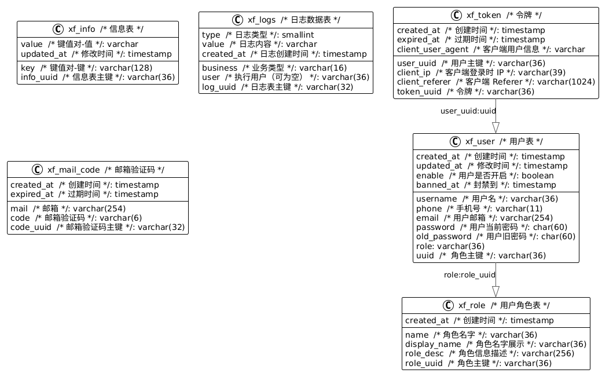

# 数据库文档

## 数据库关系

## 数据库表信息

### xf_info

| Column Name | Data Type    | Primary Key | Foreign Key | Extra                   |
| ----------- | ------------ | ----------- | ----------- | ----------------------- |
| info_uuid   | varchar(36)  | Yes         | No          | not null                |
| key         | varchar(128) | No          | No          | not null                |
| value       | varchar      | No          | No          |                         |
| updated_at  | timestamp    | No          | No          | default now(), not null |

#### Indexes

| Index Name         | Column | Type   |
| ------------------ | ------ | ------ |
| xf_info_key_uindex | key    | unique |

#### Comments

- Table: 信息表
- Column `info_uuid`: 信息表主键
- Column `key`: 键值对-键
- Column `value`: 键值对-值
- Column `updated_at`: 修改时间

### xf_logs

| Column Name | Data Type   | Primary Key | Foreign Key | Extra                   |
| ----------- | ----------- | ----------- | ----------- | ----------------------- |
| log_uuid    | varchar(32) | Yes         | No          | not null                |
| type        | smallint    | No          | No          | default 0, not null     |
| business    | varchar(16) | No          | No          | not null                |
| user        | varchar(36) | No          | No          |                         |
| value       | varchar     | No          | No          | not null                |
| created_at  | timestamp   | No          | No          | default now(), not null |

#### Comments

- Table: 日志数据表
- Column `log_uuid`: 日志表主键
- Column `type`: 日志类型
- Column `business`: 业务类型
- Column `user`: 执行用户（可为空）
- Column `value`: 日志内容
- Column `created_at`: 日志创建时间

### xf_mail_code

| Column Name | Data Type    | Primary Key | Foreign Key | Extra                   |
| ----------- | ------------ | ----------- | ----------- | ----------------------- |
| code_uuid   | varchar(32)  | Yes         | No          | not null                |
| mail        | varchar(254) | No          | No          | not null                |
| code        | varchar(6)   | No          | No          | not null                |
| created_at  | timestamp    | No          | No          | default now(), not null |
| expired_at  | timestamp    | No          | No          | not null                |

#### Indexes

| Index Name               | Column | Type   |
| ------------------------ | ------ | ------ |
| xf_mail_code_code_uindex | code   | unique |
| xf_mail_code_mail_uindex | mail   | unique |

#### Comments

- Table: 邮箱验证码
- Column `code_uuid`: 邮箱验证码主键
- Column `mail`: 邮箱
- Column `code`: 邮箱验证码
- Column `created_at`: 创建时间
- Column `expired_at`: 过期时间

### xf_role

| Column Name  | Data Type    | Primary Key | Foreign Key | Extra                   |
| ------------ | ------------ | ----------- | ----------- | ----------------------- |
| role_uuid    | varchar(36)  | Yes         | No          | not null                |
| name         | varchar(36)  | No          | No          | not null                |
| display_name | varchar(36)  | No          | No          | not null                |
| role_desc    | varchar(256) | No          | No          | not null                |
| created_at   | timestamp    | No          | No          | default now(), not null |

#### Indexes

| Index Name          | Column | Type   |
| ------------------- | ------ | ------ |
| xf_role_name_uindex | name   | unique |

#### Comments

- Table: 用户角色表
- Column `role_uuid`: 角色主键
- Column `name`: 角色名字
- Column `display_name`: 角色名字展示
- Column `role_desc`: 角色信息描述
- Column `created_at`: 创建时间

### xf_token

| Column Name       | Data Type     | Primary Key | Foreign Key | Extra                   |
| ----------------- | ------------- | ----------- | ----------- | ----------------------- |
| token_uuid        | varchar(36)   | Yes         | No          | not null                |
| user_uuid         | varchar(36)   | No          | Yes         | not null                |
| created_at        | timestamp     | No          | No          | default now(), not null |
| expired_at        | timestamp     | No          | No          | not null                |
| client_ip         | varchar(39)   | No          | No          | not null                |
| client_referer    | varchar(1024) | No          | No          |                         |
| client_user_agent | varchar       | No          | No          | not null                |

#### Foreign Keys

| Column    | References Table | References Column |
| --------- | ---------------- | ----------------- |
| user_uuid | xf_user          | uuid              |

#### Comments

- Table: 令牌
- Column `token_uuid`: 令牌
- Column `user_uuid`: 用户主键
- Column `created_at`: 创建时间
- Column `expired_at`: 过期时间
- Column `client_ip`: 客户端登录时 IP
- Column `client_referer`: 客户端 Referer
- Column `client_user_agent`: 客户端用户信息

### xf_user

| Column Name  | Data Type     | Primary Key | Foreign Key | Extra                   |
| ------------ | ------------- | ----------- | ----------- | ----------------------- |
| uuid         | varchar(36)   | Yes         | No          | not null                |
| username     | varchar(36)   | No          | No          |                         |
| phone        | varchar(11)   | No          | No          | not null                |
| email        | varchar(254)  | No          | No          |                         |
| email_verify | boolean       | No          | No          | default false, not null |
| password     | char(60)      | No          | No          | not null                |
| old_password | char(60)      | No          | No          |                         |
| role         | varchar(36)   | No          | Yes         | not null                |
| created_at   | timestamp     | No          | No          | default now(), not null |
| updated_at   | timestamp     | No          | No          | default now(), not null |
| enable       | boolean       | No          | No          | default true, not null  |
| banned_at    | timestamp     | No          | No          |                         |
| ban_reason   | varchar(1024) | No          | No          |                         |

#### Foreign Keys

| Column | References Table | References Column |
| ------ | ---------------- | ----------------- |
| role   | xf_role          | uuid              |

#### Indexes

| Index Name              | Column   | Type   |
| ----------------------- | -------- | ------ |
| xf_user_email_index     | email    | index  |
| xf_user_phone_uindex    | phone    | unique |
| xf_user_username_uindex | username | unique |

### Comments

- Table: 用户表
- Column `uuid`: 角色主键
- Column `username`: 用户名
- Column `phone`: 手机号
- Column `email`: 用户邮箱
- Column `email_verify`: 邮箱是否验证
- Column `password`: 用户当前密码
- Column `old_password`: 用户旧密码
- Column `created_at`: 创建时间
- Column `updated_at`: 修改时间
- Column `enable`: 用户是否开启
- Column `banned_at`: 封禁到
- Column `ban_reason`: 封禁原因

### xf_group

| Column Name | Data Type   | Primary Key | Foreign Key | Extra                         |
| ----------- | ----------- | ----------- | ----------- | ----------------------------- |
| group_uuid  | varchar(32) | Yes         | No          | not null                      |
| name        | varchar(30) | No          | No          | not null                      |
| master      | varchar(36) | No          | Yes         | not null                      |
| tags        | jsonb       | No          | No          | default '[]'::jsonb, not null |
| created_at  | timestamp   | No          | No          | default now(), not null       |
| updated_at  | timestamp   | No          | No          |                               |
| deleted_at  | timestamp   | No          | No          |                               |

#### Foreign Keys

| Column | References Table | References Column |
| ------ | ---------------- | ----------------- |
| master | xf_user          | uuid              |

#### Comments

- Table: 分组
- Column `group_uuid`: 小组主键
- Column `name`: 小组名字
- Column `master`: 小组队长
- Column `tags`: 类型（自定义输入，便于区分）
- Column `created_at`: 创建时间
- Column `updated_at`: 更新时间
- Column `deleted_at`: 删除时间

### xf_group_member

| Column Name       | Data Type   | Primary Key | Foreign Key | Extra                   |
| ----------------- | ----------- | ----------- | ----------- | ----------------------- |
| group_member_uuid | varchar(32) | Yes         | No          | not null                |
| group_uuid        | varchar(32) | No          | Yes         | not null                |
| user_uuid         | varchar(36) | No          | Yes         | not null                |
| status            | smallint    | No          | No          | default 0, not null     |
| created_at        | timestamp   | No          | No          | default now(), not null |
| updated_at        | timestamp   | No          | No          |                         |

#### Foreign Keys

| Column     | References Table | References Column |
| ---------- | ---------------- | ----------------- |
| group_uuid | xf_group         | group_uuid        |
| user_uuid  | xf_user          | uuid              |

#### Comments

- Table: 小组成员
- Column `group_member_uuid`: 小组成员主键
- Column `group_uuid`: 小组主键
- Column `user_uuid`: 用户主键
- Column `status`: 状态（0: 等待同意，1: 用户同意，2: 用户拒绝）
- Column `created_at`: 创建时间
- Column `updated_at`: 更新时间

### xf_schedule

| Column Name   | Data Type   | Primary Key | Foreign Key | Extra                         |
| ------------- | ----------- | ----------- | ----------- | ----------------------------- |
| schedule_uuid | varchar(32) | Yes         | No          | not null                      |
| user_uuid     | varchar(36) | No          | Yes         |                               |
| group_uuid    | varchar(32) | No          | Yes         |                               |
| name          | varchar(64) | No          | No          | not null                      |
| description   | varchar     | No          | No          |                               |
| start_time    | timestamp   | No          | No          | not null                      |
| end_time      | timestamp   | No          | No          | not null                      |
| 列_name_2     | integer     | No          | No          |                               |
| type          | smallint    | No          | No          | default 0, not null           |
| loop_type     | smallint    | No          | No          |                               |
| custom_loop   | integer     | No          | No          |                               |
| tags          | jsonb       | No          | No          | default '[]'::jsonb, not null |
| priority      | smallint    | No          | No          | default 1, not null           |
| resources     | jsonb       | No          | No          |                               |
| created_at    | timestamp   | No          | No          | default now(), not null       |
| updated_at    | timestamp   | No          | No          |                               |

#### Foreign Keys

| Column     | References Table | References Column |
| ---------- | ---------------- | ----------------- |
| user_uuid  | xf_user          | uuid              |
| group_uuid | xf_group         | group_uuid        |

#### Comments

- Table: 日程表
- Column `schedule_uuid`: 日程主键
- Column `user_uuid`: 用户主键
- Column `group_uuid`: 小组主键
- Column `name`: 日程名字
- Column `description`: 描述
- Column `start_time`: 开始时间
- Column `end_time`: 结束时间
- Column `type`: 类型（0: 单次任务，1: 循环任务，2: 一日任务）
- Column `loop_type`: 循环类型（1: 每天登录，2: 每周, 3: 每个工作日, 4: 每个月 1 号，5: 每个月 14号，0: 自定义）
- Column `custom_loop`: 自定义天数（多少天循环一次）
- Column `tags`: 标签
- Column `priority`: 优先级（1,2,3,4: 较低，低，中，高）
- Column `resources`: 导入资源
- Column `created_at`: 创建时间
- Column `updated_at`: 修改时间

### xf_friend

| Column Name       | Data Type    | Primary Key | Foreign Key | Extra                   |
| ----------------- | ------------ | ----------- | ----------- | ----------------------- |
| friend_uuid       | varchar(32)  | Yes         | No          | not null                |
| sender_user_uuid  | varchar(36)  | No          | Yes         | not null                |
| allower_user_uuid | varchar(36)  | No          | Yes         | not null                |
| sender_remarks    | varchar(128) | No          | No          |                         |
| allower_remarks   | varchar(128) | No          | No          |                         |
| is_friend         | smallint     | No          | No          | default 0, not null     |
| sent_at           | timestamp    | No          | No          | default now(), not null |
| created_at        | timestamp    | No          | No          | default now(), not null |
| updated_at        | timestamp    | No          | No          |                         |

#### Foreign Keys

| Column            | References Table | References Column |
| ----------------- | ---------------- | ----------------- |
| sender_user_uuid  | xf_user          | uuid              |
| allower_user_uuid | xf_user          | uuid              |

### Indexes

| Index Name                                          | Column Combination                  | Type   |
| --------------------------------------------------- | ----------------------------------- | ------ |
| xf_friend_sender_user_uuid_allower_user_uuid_uindex | sender_user_uuid, allower_user_uuid | unique |

#### Comments

- Table: 好友信息
- Column `friend_uuid`: 好友主键
- Column `sender_user_uuid`: 发送好友请求用户主键
- Column `allower_user_uuid`: 接受好友主键
- Column `sender_remarks`: 发送请求用户对接受用户的好友名字备注
- Column `allower_remarks`: 接受方对请求方的好友备注
- Column `is_friend`: 成为了好友(0: 等待审核, 1: 成为了好友, 2: 好友申请被拒绝)
- Column `sent_at`: 发送时间
- Column `created_at`: 创建时间
- Column `updated_at`: 更新时间

### xf_class

| Column Name      | Data Type   | Primary Key | Foreign Key | Extra                         |
| ---------------- | ----------- | ----------- | ----------- | ----------------------------- |
| class_uuid       | varchar(32) | Yes         | No          | not null                      |
| class_grade_uuid | varchar(32) | No          | Yes         | not null                      |
| semester         | varchar(48) | No          | No          | not null                      |
| start_time       | date        | No          | No          | default now(), not null       |
| end_time         | date        | No          | No          | not null                      |
| curriculum       | jsonb       | No          | No          | default '[]'::jsonb, not null |
| created_at       | timestamp   | No          | No          | default now(), not null       |
| updated_at       | timestamp   | No          | No          |                               |
| deleted_at       | timestamp   | No          | No          |                               |

#### Foreign Keys

| Column           | References Table | References Column |
| ---------------- | ---------------- | ----------------- |
| class_grade_uuid | xf_class_grade   | uuid              |

#### Comments

- Table: 课程表
- Column `class_uuid`: 课程表主键
- Column `class_grade_uuid`: 用户主键
- Column `semester`: 课程学期（名字）
- Column `start_time`: 开始时间
- Column `end_time`: 结束时间
- Column `curriculum`: 课程信息
- Column `created_at`: 创建时间
- Column `updated_at`: 更新时间
- Column `deleted_at`: 删除时间

### xf_class_grade

| Column Name      | Data Type   | Primary Key | Foreign Key | Extra                   |
| ---------------- | ----------- | ----------- | ----------- | ----------------------- |
| class_grade_uuid | varchar(32) | Yes         | No          | not null                |
| user_uuid        | varchar(36) | No          | Yes         | not null                |
| semester_begin   | date        | No          | No          | not null                |
| semester_end     | date        | No          | No          |                         |
| nickname         | varchar(64) | No          | No          | not null                |
| created_at       | timestamp   | No          | No          | default now(), not null |
| updated_at       | timestamp   | No          | No          |                         |

#### Foreign Keys

| Column    | References Table | References Column |
| --------- | ---------------- | ----------------- |
| user_uuid | xf_user          | uuid              |

#### Comments

- Table: 课程表学年
- Column `class_grade_uuid`: 课程表学年主键
- Column `user_uuid`: 用户主键
- Column `semester_begin`: 学期开始（需要存储时间为第一周的周一）
- Column `semester_end`: 学期结束
- Column `nickname`: 别名
- Column `created_at`: 创建时间
- Column `updated_at`: 更新时间

## 建表文件

[Github 建表文件](https://github.com/XiaoLFeng/schedule-planning-platform/tree/master/src/main/resources/templates/sql)