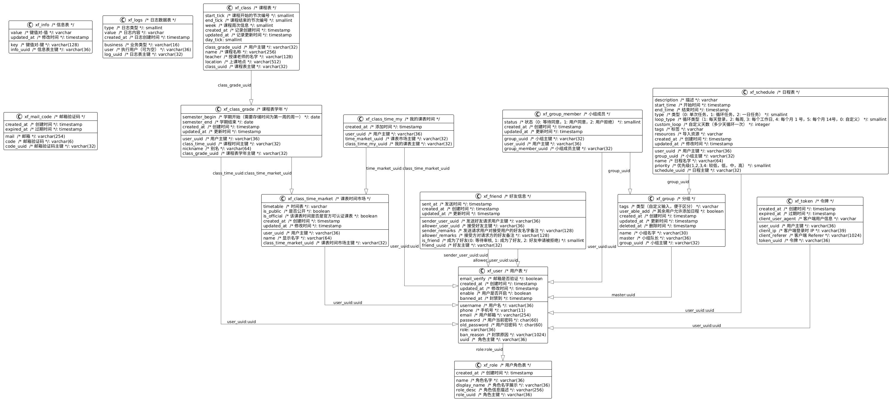

# 数据库文档

## 数据库关系

## 数据库表信息

### `xf_class`

|        NAME        |            TYPE             | NULLABLE | DEFAULT |
|--------------------|-----------------------------|----------|---------|
| `class_uuid`       | character varying           | NOT NULL |         |
| `class_grade_uuid` | character varying           | NOT NULL |         |
| `name`             | character varying           | NOT NULL |         |
| `start_tick`       | smallint                    | NOT NULL | `0`     |
| `end_tick`         | smallint                    | NOT NULL | `1`     |
| `week`             | smallint                    | NOT NULL | `1`     |
| `teacher`          | character varying           |          |         |
| `location`         | character varying           |          |         |
| `created_at`       | timestamp without time zone | NOT NULL | `now()` |
| `updated_at`       | timestamp without time zone |          |         |
| `day_tick`         | smallint                    | NOT NULL | `1`     |

### `xf_class_grade`

|        NAME        |            TYPE             | NULLABLE | DEFAULT |
|--------------------|-----------------------------|----------|---------|
| `class_grade_uuid` | character varying           | NOT NULL |         |
| `user_uuid`        | character varying           | NOT NULL |         |
| `class_time_uuid`  | character varying           |          |         |
| `semester_begin`   | date                        | NOT NULL |         |
| `semester_end`     | date                        |          |         |
| `nickname`         | character varying           | NOT NULL |         |
| `created_at`       | timestamp without time zone | NOT NULL | `now()` |
| `updated_at`       | timestamp without time zone |          |         |

### `xf_class_time_market`

|           NAME           |            TYPE             | NULLABLE |          DEFAULT          |
|--------------------------|-----------------------------|----------|---------------------------|
| `class_time_market_uuid` | character varying           | NOT NULL |                           |
| `user_uuid`              | character varying           |          |                           |
| `name`                   | character varying           | NOT NULL |                           |
| `timetable`              | character varying           | NOT NULL | `'[]'::character varying` |
| `is_public`              | boolean                     | NOT NULL | `true`                    |
| `is_official`            | boolean                     | NOT NULL | `false`                   |
| `created_at`             | timestamp without time zone | NOT NULL | `now()`                   |
| `updated_at`             | timestamp without time zone |          |                           |

### `xf_class_time_my`

|         NAME         |            TYPE             | NULLABLE | DEFAULT |
|----------------------|-----------------------------|----------|---------|
| `class_time_my_uuid` | character varying           | NOT NULL |         |
| `user_uuid`          | character varying           | NOT NULL |         |
| `time_market_uuid`   | character varying           | NOT NULL |         |
| `created_at`         | timestamp without time zone | NOT NULL | `now()` |

### `xf_friend`

|        NAME         |            TYPE             | NULLABLE | DEFAULT |
|---------------------|-----------------------------|----------|---------|
| `friend_uuid`       | character varying           | NOT NULL |         |
| `sender_user_uuid`  | character varying           | NOT NULL |         |
| `allower_user_uuid` | character varying           | NOT NULL |         |
| `sender_remarks`    | character varying           |          |         |
| `allower_remarks`   | character varying           |          |         |
| `is_friend`         | smallint                    | NOT NULL | `0`     |
| `sent_at`           | timestamp without time zone | NOT NULL | `now()` |
| `created_at`        | timestamp without time zone | NOT NULL | `now()` |
| `updated_at`        | timestamp without time zone |          |         |

### `xf_group`

|      NAME       |            TYPE             | NULLABLE |          DEFAULT          |
|-----------------|-----------------------------|----------|---------------------------|
| `group_uuid`    | character varying           | NOT NULL |                           |
| `name`          | character varying           | NOT NULL |                           |
| `master`        | character varying           | NOT NULL |                           |
| `tags`          | character varying           | NOT NULL | `'[]'::character varying` |
| `user_able_add` | boolean                     | NOT NULL | `true`                    |
| `created_at`    | timestamp without time zone | NOT NULL | `now()`                   |
| `updated_at`    | timestamp without time zone |          |                           |
| `deleted_at`    | timestamp without time zone |          |                           |

### `xf_group_member`

|        NAME         |            TYPE             | NULLABLE | DEFAULT |
|---------------------|-----------------------------|----------|---------|
| `group_member_uuid` | character varying           | NOT NULL |         |
| `group_uuid`        | character varying           | NOT NULL |         |
| `user_uuid`         | character varying           | NOT NULL |         |
| `status`            | smallint                    | NOT NULL | `0`     |
| `created_at`        | timestamp without time zone | NOT NULL | `now()` |
| `updated_at`        | timestamp without time zone |          |         |

### `xf_info`

|     NAME     |            TYPE             | NULLABLE | DEFAULT |
|--------------|-----------------------------|----------|---------|
| `info_uuid`  | character varying           | NOT NULL |         |
| `key`        | character varying           | NOT NULL |         |
| `value`      | character varying           |          |         |
| `updated_at` | timestamp without time zone | NOT NULL | `now()` |

### `xf_logs`

|     NAME     |            TYPE             | NULLABLE | DEFAULT |
|--------------|-----------------------------|----------|---------|
| `log_uuid`   | character varying           | NOT NULL |         |
| `type`       | smallint                    | NOT NULL | `0`     |
| `business`   | character varying           | NOT NULL |         |
| `user`       | character varying           |          |         |
| `value`      | character varying           | NOT NULL |         |
| `created_at` | timestamp without time zone | NOT NULL | `now()` |

### `xf_mail_code`

|     NAME     |            TYPE             | NULLABLE | DEFAULT |
|--------------|-----------------------------|----------|---------|
| `code_uuid`  | character varying           | NOT NULL |         |
| `mail`       | character varying           | NOT NULL |         |
| `code`       | character varying           | NOT NULL |         |
| `created_at` | timestamp without time zone | NOT NULL | `now()` |
| `expired_at` | timestamp without time zone | NOT NULL |         |

### `xf_role`

|      NAME      |            TYPE             | NULLABLE | DEFAULT |
|----------------|-----------------------------|----------|---------|
| `role_uuid`    | character varying           | NOT NULL |         |
| `name`         | character varying           | NOT NULL |         |
| `display_name` | character varying           | NOT NULL |         |
| `role_desc`    | character varying           | NOT NULL |         |
| `created_at`   | timestamp without time zone | NOT NULL | `now()` |

### `xf_schedule`

|      NAME       |            TYPE             | NULLABLE |          DEFAULT          |
|-----------------|-----------------------------|----------|---------------------------|
| `schedule_uuid` | character varying           | NOT NULL |                           |
| `user_uuid`     | character varying           |          |                           |
| `group_uuid`    | character varying           |          |                           |
| `name`          | character varying           | NOT NULL |                           |
| `description`   | character varying           |          |                           |
| `start_time`    | timestamp without time zone | NOT NULL |                           |
| `end_time`      | timestamp without time zone |          |                           |
| `type`          | smallint                    | NOT NULL | `0`                       |
| `loop_type`     | smallint                    |          |                           |
| `custom_loop`   | integer                     |          |                           |
| `tags`          | character varying           | NOT NULL | `'[]'::character varying` |
| `priority`      | smallint                    | NOT NULL | `1`                       |
| `resources`     | character varying           |          |                           |
| `created_at`    | timestamp without time zone | NOT NULL | `now()`                   |
| `updated_at`    | timestamp without time zone |          |                           |

### `xf_token`

|        NAME         |            TYPE             | NULLABLE | DEFAULT |
|---------------------|-----------------------------|----------|---------|
| `token_uuid`        | character varying           | NOT NULL |         |
| `user_uuid`         | character varying           | NOT NULL |         |
| `created_at`        | timestamp without time zone | NOT NULL | `now()` |
| `expired_at`        | timestamp without time zone | NOT NULL |         |
| `client_ip`         | character varying           | NOT NULL |         |
| `client_referer`    | character varying           |          |         |
| `client_user_agent` | character varying           | NOT NULL |         |

### `xf_user`

|      NAME      |            TYPE             | NULLABLE | DEFAULT |
|----------------|-----------------------------|----------|---------|
| `uuid`         | character varying           | NOT NULL |         |
| `username`     | character varying           |          |         |
| `phone`        | character varying           | NOT NULL |         |
| `email`        | character varying           |          |         |
| `email_verify` | boolean                     | NOT NULL | `false` |
| `password`     | character                   | NOT NULL |         |
| `old_password` | character                   |          |         |
| `role`         | character varying           | NOT NULL |         |
| `created_at`   | timestamp without time zone | NOT NULL | `now()` |
| `updated_at`   | timestamp without time zone | NOT NULL | `now()` |
| `enable`       | boolean                     | NOT NULL | `true`  |
| `banned_at`    | timestamp without time zone |          |         |
| `ban_reason`   | character varying           |          |         |

## 建表文件

[Github 建表文件](https://github.com/XiaoLFeng/schedule-planning-platform/tree/master/src/main/resources/templates/sql)