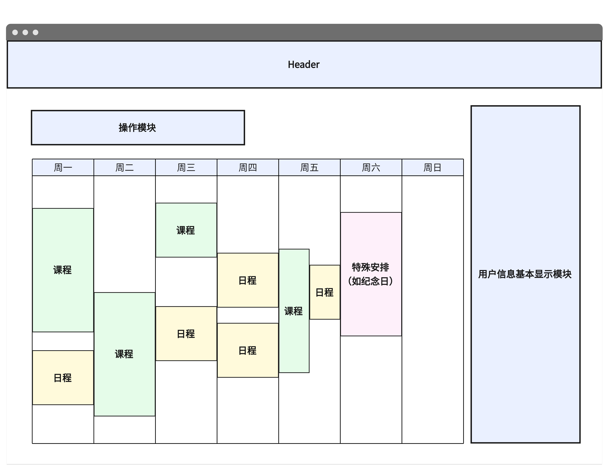
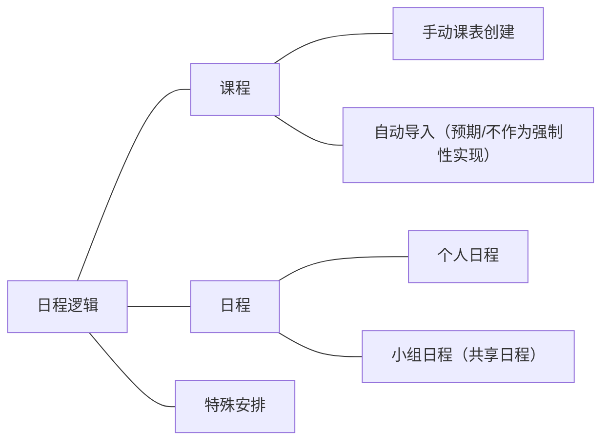

# 日程逻辑设计

在本项目中分别有课程表管理和日程规划功能。但是功能在最终实现的过程中应当是结合在一起的。如下概念图所示：

逻辑渲染图如下所示：

```mermaid
flowchart LR
	CALC[日程逻辑] --- CLASS[课程]
	CALC --- SCH[日程]
	CALC --- OTHER[特殊安排]
	
	CLASS --- HAND[手动课表创建]
	CLASS --- AUTO[自动导入（预期/不作为强制性实现）]
	SCH --- PERSONAL[个人日程]
	SCH --- GROUP[小组日程（共享日程）]
```

